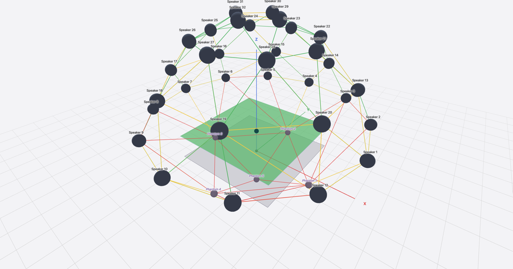

# Sound Coverage Sketch

A small browser-based tool for sound designers — sketch multichannel speaker layouts in 3D and check VBAP-family layout health, without a CAD pipeline.

→ **Live**: <https://tools.zcreation.art/coverage/>

## What it does

- **3D speaker layout** with cone visualisation from manufacturer dispersion angles
- **Audience-plane coverage heatmap** showing how many speakers reach each listener position
- **Pulkki-VBAP triangulation** with per-triangle health flags (max angle, area uniformity, L/R symmetry)
- **Phantom speakers** to sketch panning slots that aren't physical (zenith / nadir closure, etc.)
- **Save / Open as a single self-contained HTML file** — your layout travels with its viewer; share it like any other file
- **English UI** (sound-design vocabulary stays English by convention); the §2 scope disclaimer is bilingual zh-TW / EN

## What it isn't

This is a **geometric aiming sketch**, not an acoustic simulator. It does not predict SPL, frequency response, reflections, or phase, and does not model any specific renderer. It only answers two questions:

1. Is your imagined listening centre actually covered by the speakers you've placed?
2. Geometrically, is your multichannel layout healthy for VBAP-family panners?

Auditory judgement still belongs to your renderer and your ears. See [SPEC.md §2](./SPEC.md) for the full positioning statement.

## Why this exists

Theatre, live, and experimental sound designers rarely have a CAD pipeline for sketching speaker positions before a show. This tool exists to skip that barrier — drag-and-tweak a layout in a browser, see coverage, save the HTML, share it. No login, no accounts, no cloud.

Built and maintained by [Zhih-Lin Chen](https://zcreation.art) alongside a July 2026 QLab multichannel workshop.

## Stack

- Vanilla HTML + JavaScript + [p5.js](https://p5js.org/) (CDN). No build pipeline, no framework, no npm install.
- Self-contained downloads: every saved layout is a single HTML file with the editing UI inlined.
- Hosted on Cloudflare Pages.
- Design spec: [SPEC.md](./SPEC.md) (Chinese body with English headings + key terms — the spec is the single source of truth and contains the full standards-alignment caveats).

## Feedback (beta)

This is in **v1.0.0-beta**. If a sketched layout surprises you — health panel warns about something it shouldn't, or misses something it should, or wording is confusing — please [open an issue](../../issues). Beta feedback shapes v1.

Known scope limits (intentional, see [SPEC §16](./SPEC.md)):

- No SPL / loudness / frequency-response prediction (the tool shows distance and propagation delay; the rest is your domain)
- No layout preset library (5.1 / 7.1 / Octagon templates, etc.) — the workflow is "draw what you need", not "load a standard and adjust"
- No mobile-optimised editing (desktop-first; viewport < 1024px shows a banner)

## License

[MIT](./LICENSE).
